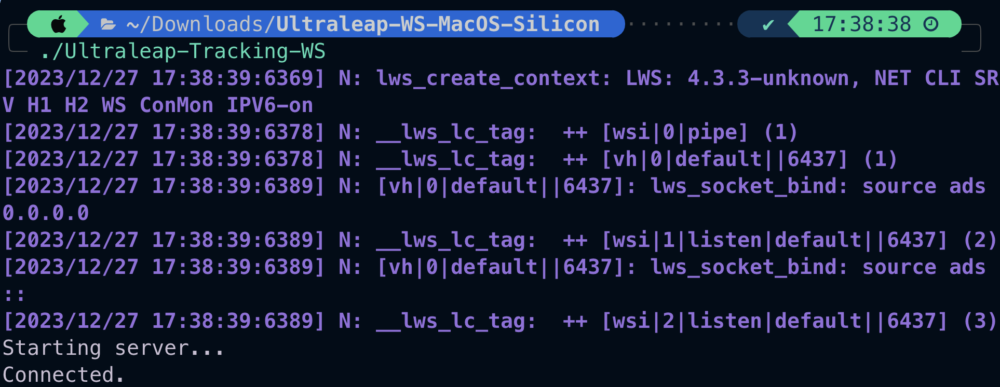

# leap_motion_final

## Setting up environment
1. Download ultraleap as the link below
2. Start up Ultraleap-Tracking-WS.exe in windows_websocket first and dont turn it down
when it works, it should have below message:

3. Use part4 to test if the device is working.
4. Start to develop base on part1/2/3 or by yourself.

## Developing progress
1. Test if leap_motion device can use.(Okay)
2. Build a program with basic controls. (In progress)
3. Add control function to final presentation.

(Gemini)[https://leap2.ultraleap.com/gemini-downloads/]
(our_ppt)[https://www.canva.com/design/DAF2FjIwo4c/ro0M585jEhGs9ekdUYk3eA/edit]
(original_github)[https://github.com/gmarzloff/leap-tracer/tree/master]